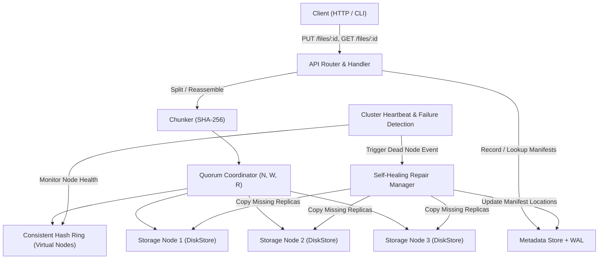

# CloudWeave

CloudWeave is a fault-tolerant, self-healing distributed object storage system written in Go. Drawing design principles from DynamoDB and Apache Cassandra, CloudWeave implements content-addressable chunking, consistent hashing with virtual nodes, configurable N/W/R quorum consensus, automated heartbeat failure detection, Write-Ahead Logging (WAL) durability, and background self-healing repair.

---

## System Architecture



---

## Core Components and Features

1. **Content-Addressable Chunking (`internal/chunk`)**
   Files are split into fixed-size data blocks. Each block is assigned a unique content-based identifier derived via SHA-256 hashing. On file retrieval, chunks are validated for integrity and reassembled in index order.

2. **Consistent Hash Ring (`internal/ring`)**
   Implements consistent hashing using 150 virtual nodes per physical node. This ensures balanced key distribution across cluster members and minimizes key migration during node joins or failures.

3. **Configurable Quorum Consensus (`internal/coordinator`)**
   Supports configurable quorum parameters:
   - **N** (Replication Factor): Total number of replicas assigned per chunk.
   - **W** (Write Quorum): Minimum number of successful write acknowledgments required for a successful write operation.
   - **R** (Read Quorum): Minimum number of successful node reads required for a valid read operation.

4. **Cluster Membership and Failure Detection (`internal/cluster`)**
   Monitors cluster member health using periodic HTTP pings. Nodes failing consecutive heartbeats are removed from the consistent hash ring and flagged as dead.

5. **Self-Healing Replication Repair (`internal/replication`)**
   When a node failure occurs, a background worker pool scans metadata manifests, identifies under-replicated chunks, and copies missing replicas from surviving nodes to target healthy nodes.

6. **Write-Ahead Logging (`internal/metadata`)**
   Ensures metadata durability by logging manifest insertions and location updates to an append-only WAL file (`metadata.wal`). On process restart, the WAL log is replayed to reconstruct the in-memory metadata store.

---

## Getting Started

### 1. Build and Run Tests

Run the complete unit and package test suite:
```bash
go test -v ./...
```

Run the automated cluster failure detection and self-healing integration test:
```bash
go test -v ./test/integration/...
```

---

### 2. Running a Local 3-Node Cluster

Start three storage node processes in separate terminal windows:

**Terminal 1 (Node 1):**
```powershell
go run cmd/node/main.go -port 8080 -data ./data-node1 -peers http://localhost:8081,http://localhost:8082
```

**Terminal 2 (Node 2):**
```powershell
go run cmd/node/main.go -port 8081 -data ./data-node2 -peers http://localhost:8080,http://localhost:8082
```

**Terminal 3 (Node 3):**
```powershell
go run cmd/node/main.go -port 8082 -data ./data-node3 -peers http://localhost:8080,http://localhost:8081
```

---

### 3. File Operations via HTTP API

#### Upload a File (`PUT /files/{id}`):
```powershell
curl.exe -X PUT --data-binary "Hello CloudWeave Distributed World!" http://localhost:8080/files/demo-doc
```

#### Retrieve a File (`GET /files/{id}`):
```powershell
curl.exe http://localhost:8080/files/demo-doc
```

#### Self-Healing Failure Demo:
1. Terminate Node 2 in Terminal 2.
2. Observe Node 1 output log:
   `[Cluster] Event: Node http://localhost:8081 died, submitting repair job...`
   `[RepairWorker 0] Repair for http://localhost:8081 completed`
3. Download the file again from Node 1 or Node 3 to confirm data availability:
   ```powershell
   curl.exe http://localhost:8080/files/demo-doc
   ```