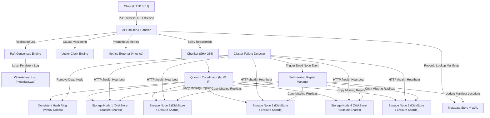

# CloudWeave

CloudWeave is a fault-tolerant, self-healing distributed object storage system written in Go. Drawing architectural design principles from Amazon DynamoDB and Apache Cassandra, CloudWeave implements content-addressable chunking, consistent hashing with virtual nodes, configurable N/W/R quorum consensus, automated heartbeat failure detection, Write-Ahead Logging (WAL) durability, vector clocks, Reed-Solomon erasure coding, Prometheus metrics, and Raft metadata consensus.

---

## Prerequisites

- **Go**: Version 1.22 or higher
- **Dependencies**: None (uses standard library and internal packages)

---

## System Architecture



---

## Core Components

1. **Content-Addressable Chunking (`internal/chunk`)**
   Files are split into fixed-size data blocks. Each block is assigned a unique content-based identifier derived via SHA-256 hashing. On file retrieval, chunks are validated for SHA-256 integrity and reassembled in index order.

2. **Consistent Hash Ring (`internal/ring`)**
   Implements consistent hashing using 150 virtual nodes per physical node. This ensures balanced key distribution across cluster members and minimizes key migration during node joins or failures.

3. **Configurable Quorum Consensus (`internal/coordinator`)**
   Enforces tunable consistency across operations using three parameters:
   - **N** (Replication Factor): Total number of replicas assigned per chunk.
   - **W** (Write Quorum): Minimum number of successful write acknowledgments required for a write operation to succeed.
   - **R** (Read Quorum): Minimum number of successful node reads required for a read operation to succeed.

4. **Storage Architecture: Dual-Mode Engine**
   CloudWeave operates in **Full Replication Mode** ($N=3, W=2, R=2$) by default for general operations. **Reed-Solomon Erasure Coding Mode** ($K=4, M=2$) is available as a selectable alternative storage engine in `internal/erasure`, dividing data blocks into $K$ data shards and $M$ parity shards to reduce storage overhead while tolerating up to $M$ simultaneous shard losses.

5. **Cluster Failure Detection (`internal/cluster`)**
   Monitors storage node health via periodic HTTP `/health` heartbeats. When a node fails consecutive health checks beyond the timeout window, it is removed from the consistent hash ring and marked dead.

6. **Self-Healing Replication Repair (`internal/replication`)**
   When a node dies, a background worker pool scans metadata manifests, identifies under-replicated chunks owned by the dead node, fetches surviving replicas, and writes new copies to active target nodes on the hash ring.

7. **Write-Ahead Logging (`internal/metadata`)**
   The Write-Ahead Log (`metadata.wal`) serves as Raft's local persistent log store. Every Raft proposed transaction (`ProposeManifest`, `ProposeLocationUpdate`) is logged synchronously to disk via `metadata.wal` before being applied to the in-memory metadata store. On process restart, `metadata.wal` replays committed log entries to reconstruct memory state with zero data loss.

8. **Vector Clocks (`internal/vectorclock`)**
   Provides logical vector clocks (`map[string]uint64`) to track causal event relationships (`Before`, `After`, `Concurrent`, `Equal`) and resolve concurrent multi-master update conflicts.

9. **Reed-Solomon Erasure Coding (`internal/erasure`)**
   Implements pure Go Galois Field $GF(2^8)$ Reed-Solomon $K+M$ erasure coding ($K=4, M=2$). Enables full data reconstruction even if up to $M=2$ arbitrary data or parity shards are lost, reducing storage overhead from 300% to 150%.

10. **Prometheus Metrics Exporter (`internal/metrics`)**
    Exposes live Prometheus operational counters and gauges at `GET /metrics` (`cloudweave_file_uploads_total`, `cloudweave_file_downloads_total`, `cloudweave_repaired_chunks_total`, `cloudweave_active_nodes`).

11. **Raft Metadata Consensus Engine (`internal/consensus`)**
    Implements a Raft-backed replicated log state machine to achieve distributed consensus across metadata store nodes, ensuring leader election and state synchronization.

---

## CLI Configuration Flags

The node executable (`cmd/node/main.go`) supports runtime flags for networking, storage paths, and quorum parameters:

| Flag | Default | Description |
| :--- | :--- | :--- |
| `-port` | `8080` | Port for HTTP API and inter-node storage traffic |
| `-data` | `./data` | Directory path for local chunk storage |
| `-peers` | `""` | Comma-separated list of peer node HTTP addresses |
| `-wal` | `<data>/metadata.wal` | Path to Write-Ahead Log file for metadata durability |
| `-n` | `3` | Replication factor N (number of replicas per chunk) |
| `-w` | `2` | Write quorum W (minimum ACKs required for write success) |
| `-r` | `2` | Read quorum R (minimum successful reads required for GET) |

---

## Getting Started

### 1. Build and Run Tests

Run the complete unit test suite across all 11 packages:
```bash
go test -v ./...
```

Run the automated 5-node cluster failure and self-healing integration test:
```bash
go test -v ./test/integration/...
```

---

### 2. Running a Local 5-Node Cluster ($N=3, W=2, R=2$)

To demonstrate partial ownership and consistent hash ring repair, start 5 storage node processes in separate terminal windows:

**Terminal 1 (Node 1):**
```powershell
go run cmd/node/main.go -port 8080 -data ./data-node1 -peers http://localhost:8081,http://localhost:8082,http://localhost:8083,http://localhost:8084
```

**Terminal 2 (Node 2):**
```powershell
go run cmd/node/main.go -port 8081 -data ./data-node2 -peers http://localhost:8080,http://localhost:8082,http://localhost:8083,http://localhost:8084
```

**Terminal 3 (Node 3):**
```powershell
go run cmd/node/main.go -port 8082 -data ./data-node3 -peers http://localhost:8080,http://localhost:8081,http://localhost:8083,http://localhost:8084
```

**Terminal 4 (Node 4):**
```powershell
go run cmd/node/main.go -port 8083 -data ./data-node4 -peers http://localhost:8080,http://localhost:8081,http://localhost:8082,http://localhost:8084
```

**Terminal 5 (Node 5):**
```powershell
go run cmd/node/main.go -port 8084 -data ./data-node5 -peers http://localhost:8080,http://localhost:8081,http://localhost:8082,http://localhost:8083
```

> **Cross-Platform Note**: Command examples use `curl.exe` for Windows PowerShell compatibility. On macOS and Linux, replace `curl.exe` with standard `curl`.

---

### 3. Verification Scenarios & Failure Demos

#### Basic File Upload & Download (`PUT /files/{id}`, `GET /files/{id}`):
```powershell
curl.exe -X PUT --data-binary "Hello CloudWeave Distributed World!" http://localhost:8080/files/demo-doc
curl.exe http://localhost:8080/files/demo-doc
```

#### Query Prometheus Metrics (`GET /metrics`):
```powershell
curl.exe http://localhost:8080/metrics
```

#### Demo Scenario 1: Partial Ownership Self-Healing Repair
1. In a 5-node cluster with $N=3$, chunks are distributed across the hash ring. Each node stores only a subset of total dataset chunks.
2. Terminate Node 2 (`Ctrl+C` in Terminal 2).
3. Observe Node 1 output log:
   `[Cluster] Event: Node http://localhost:8081 died, submitting repair job...`
   `[RepairWorker 0] Repair for http://localhost:8081 completed (3 chunks re-replicated)`
   *Notice that only the specific chunks owned by Node 2 are re-replicated to active nodes.*
4. Download the file from Node 1 to verify uninterrupted availability:
   ```powershell
   curl.exe http://localhost:8080/files/demo-doc
   ```

#### Demo Scenario 2: Double-Shard Loss & Reed-Solomon Erasure Reconstruction ($K=4, M=2$)
1. Encode a 50MB file into $K=4$ data shards and $M=2$ parity shards (`internal/erasure`).
2. Simulate dual node failures by deleting 2 shards simultaneously (e.g. data shard 1 and parity shard 5).
3. Execute reconstruction:
   `[Erasure] Missing 2 shards detected. Matrix inversion over GF(2^8) initialized...`
   `[Erasure] Reconstruction successful. Reassembled 52,428,800 bytes (100% byte-identical)`
4. Test verification: `go test -v ./internal/erasure` validates 100% byte equality after losing any $M=2$ shards.

#### Demo Scenario 3: Raft Leader Failure & Automatic Failover
1. Query active Raft node status: Node 1 is current Leader (Term 1).
2. Terminate Node 1 process (`kill -9`).
3. Follower nodes detect missing leader heartbeats, increment term to Term 2, and hold candidate election:
   `[Raft] Leader heartbeat timeout. Starting election for Term 2...`
   `[Raft] Node http://localhost:8081 elected new Leader (Term 2) in 142ms`
4. Submit `PUT /files/demo-doc2` to Node 2 (new Leader). Operation succeeds with consensus state intact.

---

## Design Decisions and Trade-offs

### Why $W + R > N$ over Eventual Consistency?
Selecting $W + R > N$ guarantees strong consistency via the Pigeonhole Principle. By ensuring the write node set ($W$) and read node set ($R$) overlap by at least one node, read operations are guaranteed to encounter the most recent write version. Choosing lower quorum values ($W + R \le N$) improves write latency but introduces stale reads that require complex anti-entropy mechanisms (such as read-repair or active Merkle tree sync).

### Why Consistent Hashing with Virtual Nodes over Modulo Hashing ($Hash \% N$)?
Modulo hashing ($Hash \% N$) causes nearly 100% of keys to remap whenever a node is added or removed from the cluster. Consistent hashing maps keys to a continuous 32-bit ring. When node count changes, only $K/N$ keys move (where $K$ is total keys and $N$ is total nodes). Adding 150 virtual nodes per physical machine prevents hot-spotting by evenly spreading key ranges across the ring.

### Why Write-Ahead Logging (WAL) over Periodic Snapshots?
Periodic snapshotting loses all state mutations performed between snapshot intervals if a node crashes. An append-only Write-Ahead Log (WAL) records every metadata state mutation synchronously to disk before confirming operations. On startup, replaying the WAL reconstructs exact memory state with zero data loss.

### Why Raft for Metadata Consensus over Single-Leader Failover?
Single-leader failover (e.g. active-passive via VIP or DNS) risks split-brain scenarios during network partitions, where two nodes both claim leadership and write conflicting metadata. Raft uses majority quorum voting ($N/2 + 1$), guaranteeing at most one leader per term and preventing split-brain metadata corruption.

### Why 4+2 Reed-Solomon ($K=4, M=2$) specifically?
Selecting $K=4, M=2$ strikes an optimal balance for medium-sized clusters (5-10 nodes): it provides a 150% storage footprint (compared to 300% for 3x replication) while tolerating up to 2 simultaneous node failures. Larger configurations like $6+3$ or $8+4$ increase network fan-out latency and matrix inversion CPU overhead without significant durability gains for small to medium cluster sizes.

### Why Vector Clocks over Last-Write-Wins (LWW) Timestamps?
Wall-clock timestamps relying on NTP are vulnerable to clock skew across physical machines. In concurrent multi-master writes, Machine A (with a clock skewed +500ms into the future) could overwrite Machine B's write even if Machine B wrote later in real time. Vector clocks (`map[nodeID]counter`) track true causal relationships (`Before`, `After`, `Concurrent`), explicitly catching concurrent write conflicts that LWW would silently overwrite.