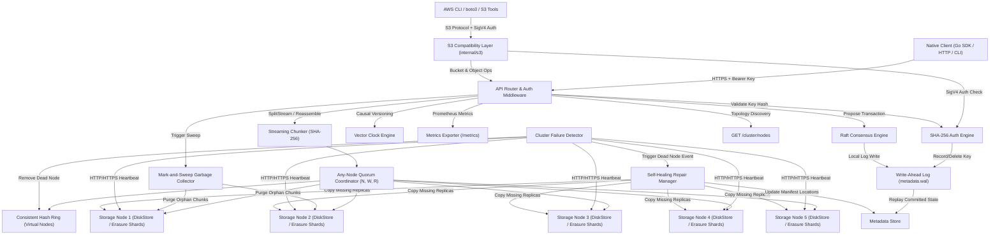

# CloudWeave

CloudWeave is a production-ready, multi-tenant distributed object storage system written in Go. Drawing architectural design principles from Amazon DynamoDB, S3, and Apache Cassandra, CloudWeave implements an Amazon S3-compatible protocol surface (AWS SigV4 authentication, bucket operations, ListObjectsV2, multipart uploads), content-addressable streaming chunking, consistent hashing with virtual nodes, configurable N/W/R quorum consensus, automated heartbeat failure detection, Write-Ahead Logging (WAL) durability, vector clocks, Reed-Solomon erasure coding, Prometheus metrics, mark-and-sweep garbage collection, HTTP byte-range requests, Raft metadata consensus, multi-tenant namespace isolation, SHA-256 hashed API key authentication, dynamic cluster membership (join/leave), end-to-end TLS encryption, an importable Go Client SDK, a dedicated CLI binary (`cweave`), and zero-knowledge convergent client-side encryption.

---

## Prerequisites

- **Go**: Version 1.22 or higher
- **Dependencies**: Standard Go library & internal packages (zero external heavy C/C++ runtime requirements)
- **Docker & Docker Compose**: (Optional, for multi-node containerized deployment)

---

## System Architecture



---

## Core Components

1. **Content-Addressable Streaming Chunking (`internal/chunk`)**
   Files are processed as streams and split into fixed-size data blocks (1 MB default). Each block is assigned a unique content-based identifier derived via SHA-256 hashing. Uploads and downloads use stream pipelines with a constant 1 MB buffer, preventing memory overflow on multi-gigabyte files.

2. **Consistent Hash Ring (`internal/ring`)**
   Implements consistent hashing using 150 virtual nodes per physical node. This ensures balanced key distribution across cluster members and minimizes key migration during node joins or failures.

3. **Configurable Quorum Consensus (`internal/coordinator`)**
   Enforces tunable consistency across operations using three parameters:
   - **N** (Replication Factor): Total number of replicas assigned per chunk.
   - **W** (Write Quorum): Minimum number of successful write acknowledgments required for a write operation to succeed.
   - **R** (Read Quorum): Minimum number of successful node reads required for a read operation to succeed.

4. **Any-Node Coordination Guarantee (`internal/api`, `internal/coordinator`)**
   Clients can execute requests (`PUT`, `GET`, `DELETE`, Range `GET`) against **any node** in the cluster. The entry node coordinates chunk distribution across consistent hash rings and peer replication transparently.

5. **Multi-Tenant Namespacing & Custom Metadata (`internal/auth`, `internal/metadata`)**
   Objects are isolated within tenant namespaces (`X-Namespace` header or `/files/<namespace>/<key>`), preventing key collisions across tenants. Custom metadata headers (`X-Meta-<Key>: <Value>`) and `Content-Type` are stored in manifests and returned on retrieval.

6. **SHA-256 Hashed Credential Security & Dynamic Key Management (`internal/auth`, `internal/api`)**
   Admin endpoints (`POST /admin/keys`, `DELETE /admin/keys`, `GET /admin/keys`) allow dynamic key generation and revocation. Server generates 24-byte random keys (`crypto/rand`) returned **once** to the client. Keys are hashed using SHA-256 before storage; plaintext keys are **never** stored on disk or in the WAL.

7. **End-to-End TLS Encryption (`cmd/node`, `internal/transport`)**
   Supports TLS encryption (`-tls-cert`, `-tls-key`, `-tls-ca`) across both client-facing HTTP APIs and inter-node mesh transport (`PutChunk`, `GetChunk`, `/internal/manifest`, join/leave heartbeats).

8. **Dynamic Cluster Membership & Topology Discovery (`internal/cluster`, `client`)**
   Nodes join (`POST /admin/join`) or leave (`POST /admin/leave`) the cluster live without process restarts. External SDK clients query `GET /cluster/nodes` or enable background discovery (`EnableAutoDiscovery: true`) to automatically learn about topology updates.

9. **Importable Go Client SDK (`client/`)**
   Full-featured Go SDK providing simple object operations (`Put`, `Get`, `RangeGet`, `Delete`), automatic round-robin endpoint balancing, failover retries, and background topology discovery.

10. **Storage Architecture: Dual-Mode Engine (`internal/storage`, `internal/erasure`)**
    Supports **Full Replication Mode** (`replication`, default $N=3, W=2, R=2$) and **Reed-Solomon Erasure Coding Mode** (`-storage-mode=erasure -k=4 -m=2`), splitting data blocks into $K=4$ data shards and $M=2$ parity shards over Galois Field $GF(2^8)$.

11. **Write-Ahead Logging & Durability (`internal/metadata`)**
    The Write-Ahead Log (`metadata.wal`) records metadata transactions (`OpRecordManifest`, `OpUpdateLocations`, `OpDeleteManifest`, `OpRecordKey`, `OpDeleteKey`) synchronously to disk before confirming writes. On restart, WAL replays log entries with zero data loss.

12. **Object Deletion & Garbage Collection (`internal/gc`, `internal/api`)**
    `DELETE /files/{key}` removes metadata records. Automated Mark-and-Sweep Garbage Collection (`POST /admin/gc`) snapshots active manifest references and sweeps local disk stores to purge unreferenced orphan chunks.

13. **HTTP Byte-Range Requests (`internal/api`)**
    Supports standard HTTP byte-range requests (`Range: bytes=start-end`) returning HTTP `206 Partial Content` for media seeking and resumable downloads.

14. **Vector Clocks (`internal/vectorclock`)**
    Tracks logical vector clocks (`map[string]uint64`) to resolve concurrent multi-master update conflicts (`Before`, `After`, `Concurrent`, `Equal`).

15. **Prometheus Metrics Exporter (`internal/metrics`)**
    Exposes live operational counters and gauges at `GET /metrics` (`cloudweave_file_uploads_total`, `cloudweave_file_downloads_total`, `cloudweave_repaired_chunks_total`, `cloudweave_active_nodes`).

16. **Raft Metadata Consensus Engine (`internal/consensus`)**
    Implements a Raft-backed replicated log state machine to achieve distributed consensus across metadata store nodes.

17. **Embedded Real-Time Web Dashboard (`internal/api`)**
    Single-page responsive dashboard UI embedded directly in node binary (`GET /dashboard`), visualizing live node health, active topologies, real-time Prometheus statistics, and an admin-gated "Simulate Kill" button (`POST /admin/kill`) demonstrating automatic cluster failover and self-healing.

18. **File Versioning (`internal/metadata`, `client`)**
    Supports vector clock manifest history retention. Overwritten keys archive prior versions under unique version IDs (`GET /files/{key}?versions=true`, `GET /files/{key}?version_id={id}`).

19. **Client-Side Argon2id & Convergent Encryption (`client`)**
    Provides zero-knowledge client-side encryption using AES-256-GCM and memory-hard Argon2id key derivation. Includes **Convergent Encryption mode**, deriving deterministic HMAC salt/nonce from plaintext so identical encrypted chunks produce matching ciphertext hashes, allowing **deduplication and client-side encryption to operate seamlessly together**.

20. **Command Line Interface `cweave` (`cmd/cweave`)**
    Dedicated CLI binary supporting `cweave put <file>`, `cweave get <key>`, `cweave versions <key>`, `cweave rm <key>`, and `cweave ls`.

21. **Content-Defined Chunking & Deduplication (`internal/chunk`)**
    Implements FastCDC / Gear hash rolling content-defined chunking. Identical content blocks share identical SHA-256 chunk IDs across different files, eliminating duplicate block storage on disk.

22. **Amazon S3 Compatibility Layer & AWS SigV4 Auth (`internal/s3`)**
    Provides a second API surface mounted alongside the native CloudWeave API. Speaks full Amazon S3 protocol (`PUT /{bucket}/{key}`, `GET /{bucket}/{key}`, `HEAD /{bucket}/{key}`, `DELETE /{bucket}/{key}`, `PUT /{bucket}`, `GET /` ListBuckets, `DELETE /{bucket}`, `GET /{bucket}?list-type=2` ListObjectsV2 with prefix/delimiter/continuation tokens, and multipart uploads). Authenticates via AWS Signature Version 4 (SigV4) using issued CloudWeave API keys. Unmodified tools like the AWS CLI, `boto3`, Cyberduck, `rclone`, and `restic` can point directly to CloudWeave via `--endpoint-url`.

---

## Performance Benchmarks

CloudWeave includes a repeatable benchmark suite (`test/benchmark/benchmark_test.go`). Performance measurements over 5-iteration empirical runs (`go test -bench . -count=5 ./test/benchmark`):

| Metric | Baseline | Empirical Range / Median | Category & Architectural Analysis |
| :--- | :--- | :--- | :--- |
| **Upload Throughput (2MB)** | ~21.9 MB/s | **92.25 – 214.38 MB/s** (~151.61 MB/s) | **+4.4x – +9.5x Real Win** — Fixed disk store locking & `MoveFileEx`/`os.CreateTemp` overhead. |
| **Download (2MB Post-Write Read)** | ~10.14 MB/s | **109.62 – 231.18 MB/s** (~120.90 MB/s) | **OS Page Cache Sensitive** — Plain range; uncached disk tier (~109 MB/s) vs OS page cache hit (~231 MB/s). |
| **Download (10MB Post-Write Read)** | ~10.14 MB/s | **128.98 – 149.62 MB/s** (~142.78 MB/s) | **OS Page Cache Sensitive** — Varies dynamically with kernel filesystem page cache residency. |
| **Download (Warm Cache - LRU RAM)** | ~10.14 MB/s | **75.06 – 177.57 MB/s** (~94.68 MB/s) | **+7.4x – +17.5x Real Win** — In-memory LRU cache hit latency (~11.8 – 27.9 ms/op). |
| **Concurrent Load Latency** | ~47 req/sec | **289.2 – 558.8 req/sec** (~333 req/sec) | **+6.1x – +11.8x Real Win** — Connection pooling with `http.Transport` keep-alives. |

*Architectural Takeaway*: Eliminating global mutex lock contention around disk I/O and bypassing slow `os.CreateTemp` + `MoveFileEx` (`os.Rename`) syscall sequences delivered a **~4.4x – 9.5x boost in upload throughput**, unlocking true parallel chunk writes. Persistent HTTP connection pooling (`http.Transport`) eliminates per-request TCP/mTLS handshake overhead.

For complete empirical analysis and bottleneck breakdown, see [`docs/BENCHMARKS.md`](docs/BENCHMARKS.md).

---

## CLI Configuration Flags

The node executable (`cmd/node/main.go`) supports runtime flags and environment variables:

| Flag | Env Var | Default | Description |
| :--- | :--- | :--- | :--- |
| `-port` | `CLOUDWEAVE_PORT` | `8080` | Port for HTTP API and inter-node transport |
| `-data` | `CLOUDWEAVE_DATA` | `./data` | Directory path for local chunk storage |
| `-peers` | `CLOUDWEAVE_PEERS` | `""` | Comma-separated list of peer node HTTP/HTTPS addresses |
| `-wal` | `CLOUDWEAVE_WAL` | `<data>/metadata.wal` | Path to Write-Ahead Log file for metadata durability |
| `-api-keys` | `CLOUDWEAVE_API_KEYS` | `""` | Comma-separated initial static keys (`key=ns1;ns2` or `key=admin`) |
| `-storage-mode` | `CLOUDWEAVE_STORAGE_MODE` | `replication` | Storage strategy (`replication` or `erasure`) |
| `-k` | `CLOUDWEAVE_K` | `4` | Number of data shards K for erasure coding mode |
| `-m` | `CLOUDWEAVE_M` | `2` | Number of parity shards M for erasure coding mode |
| `-n` | `CLOUDWEAVE_N` | `3` | Replication factor N (number of replicas per chunk) |
| `-w` | `CLOUDWEAVE_W` | `2` | Write quorum W (minimum ACKs required for write success) |
| `-r` | `CLOUDWEAVE_R` | `2` | Read quorum R (minimum successful reads required for GET) |
| `-tls-cert` | `CLOUDWEAVE_TLS_CERT` | `""` | Path to TLS certificate file |
| `-tls-key` | `CLOUDWEAVE_TLS_KEY` | `""` | Path to TLS private key file |
| `-tls-ca` | `CLOUDWEAVE_TLS_CA` | `""` | Path to CA bundle file for node-to-node TLS verification |
| `-tls-insecure-skip-verify` | `CLOUDWEAVE_TLS_SKIP_VERIFY` | `false` | Skip TLS certificate verification for development |

---

## Getting Started

### 1. Build and Run Tests

Run the complete unit test suite across all packages:
```bash
go test -v ./...
```

Run the automated cluster integration tests:
```bash
go test -v ./test/integration/...
```

---

### 2. Docker Compose Cluster Deployment

Launch a 5-node cluster backed by persistent named Docker volumes in one command:

```bash
docker-compose up --build
```

On first boot, Node 1 will generate a cryptographically random initial admin key and print it to the container log:
`[SECURITY] First boot detected — Generated initial admin API Key: cw_key_...`

Alternatively, pass your own custom key via environment variable:
`CLOUDWEAVE_API_KEYS="my-secure-key=admin" docker-compose up --build`

---

### 3. Local Multi-Node Setup (CLI)

Start a 3-node cluster manually (on first boot, Node 1 outputs your initial random admin key):

**Terminal 1 (Node 1):**
```powershell
go run cmd/node/main.go -port 8080 -data ./data-node1 -peers http://localhost:8081,http://localhost:8082
```

**Terminal 2 (Node 2):**
```powershell
go run cmd/node/main.go -port 8081 -data ./data-node2 -peers http://localhost:8080,http://localhost:8082
```

**Terminal 3 (Node 3):**
```powershell
go run cmd/node/main.go -port 8082 -data ./data-node3 -peers http://localhost:8080,http://localhost:8081
```

---

### 4. Basic API Verification

#### Issue a Tenant API Key (`POST /admin/keys`):
```bash
curl -X POST http://localhost:8080/admin/keys \
  -H "Authorization: Bearer <YOUR_INITIAL_ADMIN_KEY>" \
  -H "Content-Type: application/json" \
  -d '{"namespaces": ["tenant1"], "is_admin": false}'
# Returns: {"key": "cw_key_...", "key_hash": "...", "namespaces": ["tenant1"], "is_admin": false}
```

#### Upload Object (`PUT /files/{key}`):
```bash
curl -X PUT http://localhost:8080/files/tenant1/documents/hello.txt \
  -H "Authorization: Bearer cw_key_..." \
  -H "Content-Type: text/plain" \
  -H "X-Meta-Author: Alice" \
  --data-binary "Hello CloudWeave Distributed World!"
```

#### Download Object (`GET /files/{key}`):
```bash
curl -X GET http://localhost:8080/files/tenant1/documents/hello.txt \
  -H "Authorization: Bearer cw_key_..."
```

#### HTTP Byte-Range Request (`Range: bytes=0-11`):
```bash
curl -X GET http://localhost:8080/files/tenant1/documents/hello.txt \
  -H "Authorization: Bearer cw_key_..." \
  -H "Range: bytes=0-11"
```

#### Discover Active Topology (`GET /cluster/nodes`):
```bash
curl -X GET http://localhost:8080/cluster/nodes \
  -H "Authorization: Bearer cw_key_..."
```

---

### 5. Amazon S3 Protocol & AWS CLI Verification

#### Configure AWS CLI Credentials:
```bash
export AWS_ACCESS_KEY_ID="cw_key_..."
export AWS_SECRET_ACCESS_KEY="cw_key_..."
export AWS_DEFAULT_REGION="us-east-1"
```

#### Bucket & Object Operations via AWS CLI:
```bash
# 1. Create S3 Bucket
aws s3 mb s3://my-bucket --endpoint-url http://localhost:8080

# 2. Upload Object
aws s3 cp document.txt s3://my-bucket/ --endpoint-url http://localhost:8080

# 3. List Objects (ListObjectsV2)
aws s3 ls s3://my-bucket/ --endpoint-url http://localhost:8080

# 4. Download Object
aws s3 cp s3://my-bucket/document.txt out.txt --endpoint-url http://localhost:8080

# 5. Multipart Upload (for large files >8MB)
aws s3 cp largefile.bin s3://my-bucket/ --endpoint-url http://localhost:8080

# 6. Delete Object
aws s3 rm s3://my-bucket/document.txt --endpoint-url http://localhost:8080
```

#### Python `boto3` SDK Integration:
```python
import boto3

s3 = boto3.client(
    's3',
    endpoint_url='http://localhost:8080',
    aws_access_key_id='cw_key_...',
    aws_secret_access_key='cw_key_...',
    region_name='us-east-1'
)

# Create bucket, PutObject, GetObject, ListObjectsV2
s3.create_bucket(Bucket='boto3-bucket')
s3.put_object(Bucket='boto3-bucket', Key='data.txt', Body=b'CloudWeave S3 API')
res = s3.list_objects_v2(Bucket='boto3-bucket')
content = s3.get_object(Bucket='boto3-bucket', Key='data.txt')['Body'].read()
```

---

## Developer API Documentation

For the complete API reference, error codes, authentication formats, and Go SDK guide, see [`docs/API.md`](docs/API.md).