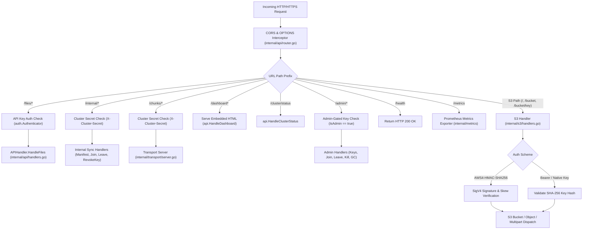
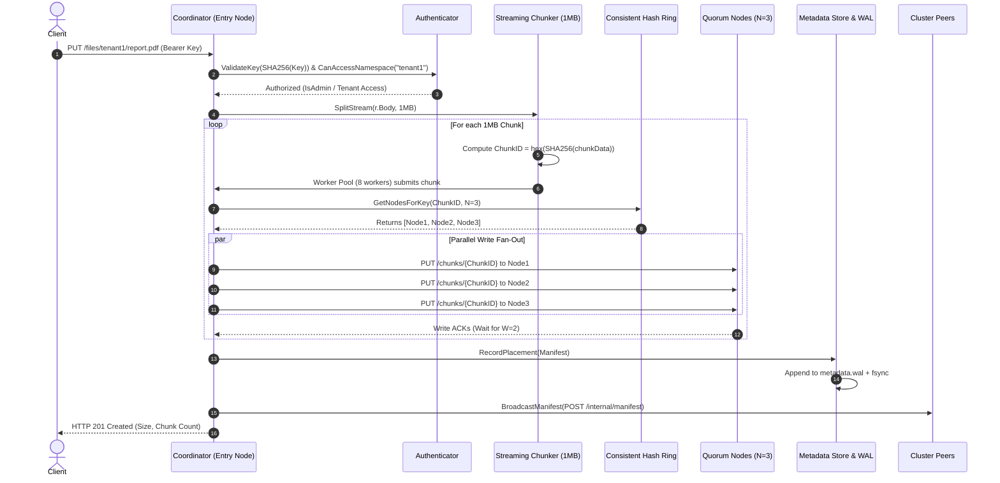
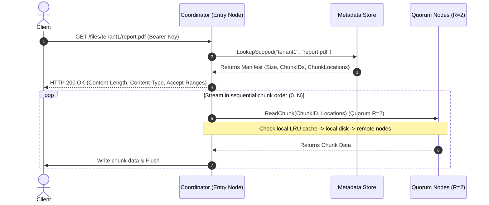
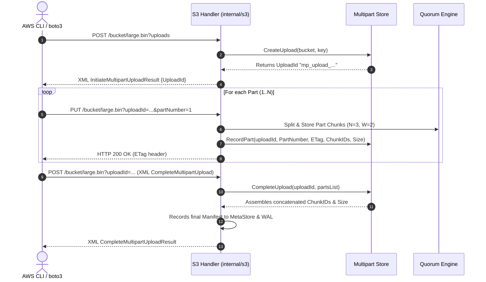
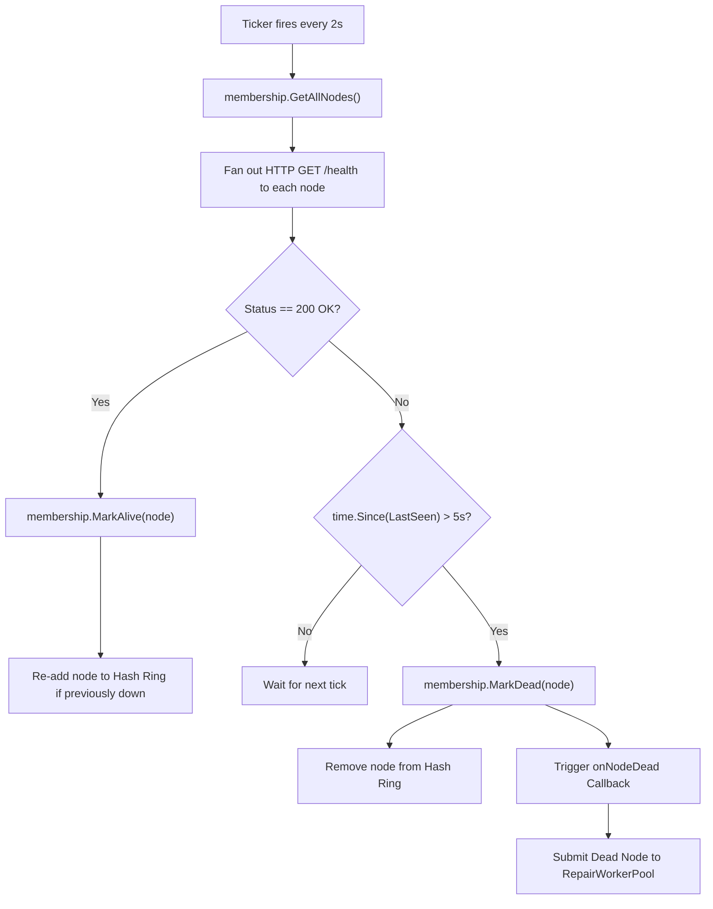
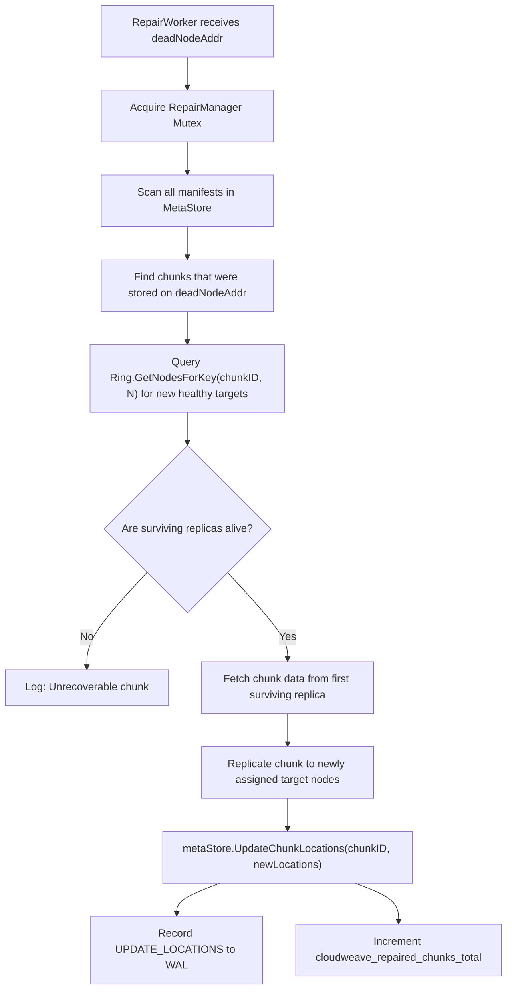
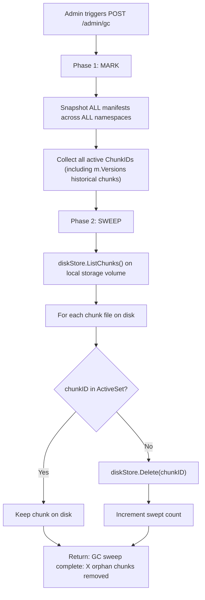

# CloudWeave — File Routing, Architecture & Workflow Guide (`workflow.md`)

This document details the **codebase organization**, **file routing map**, **request lifecycles**, **background daemons**, and **system workflows** of CloudWeave.

---

## Table of Contents

1. [Project Directory & File Structure](#1-project-directory--file-structure)
2. [HTTP Routing & Dispatch Architecture](#2-http-routing--dispatch-architecture)
3. [End-to-End Request Lifecycles](#3-end-to-end-request-lifecycles)
   - [3.1 Object Upload Flow (`PUT /files/{ns}/{key}`)](#31-object-upload-flow-put-filesnskey)
   - [3.2 Object Download & Streaming Flow (`GET /files/{ns}/{key}`)](#32-object-download--streaming-flow-get-filesnskey)
   - [3.3 HTTP Byte-Range Seeking Flow (`Range: bytes=start-end`)](#33-http-byte-range-seeking-flow-range-bytesstart-end)
   - [3.4 Object Deletion Flow (`DELETE /files/{ns}/{key}`)](#34-object-deletion-flow-delete-filesnskey)
   - [3.5 Amazon S3 SigV4 & `aws-chunked` Upload Flow](#35-amazon-s3-sigv4--aws-chunked-upload-flow)
   - [3.6 S3 Multipart Upload Workflow](#36-s3-multipart-upload-workflow)
4. [Background Daemons & Cluster Workflows](#4-background-daemons--cluster-workflows)
   - [4.1 Heartbeat & Failure Detection Loop](#41-heartbeat--failure-detection-loop)
   - [4.2 Self-Healing & Automated Repair Workflow](#42-self-healing--automated-repair-workflow)
   - [4.3 Two-Phase Mark-and-Sweep Garbage Collection](#43-two-phase-mark-and-sweep-garbage-collection)
   - [4.4 Dynamic Cluster Join and Leave Workflows](#44-dynamic-cluster-join-and-leave-workflows)
5. [Client SDK & CLI Workflow](#5-client-sdk--cli-workflow)

---

## 1. Project Directory & File Structure

```
cloudWeave/
├── cmd/
│   ├── node/
│   │   └── main.go                 # Node daemon entry point (wires storage, transport, S3, API, cluster)
│   └── cweave/
│       └── main.go                 # CLI client binary (put, get, versions, rm, ls)
├── client/
│   ├── client.go                   # Go SDK (round-robin endpoint pool, auto-discovery, retries)
│   ├── crypto.go                   # Client-side AES-256-GCM + Argon2id / Convergent encryption
│   └── client_test.go              # SDK unit and integration tests
├── internal/
│   ├── api/
│   │   ├── handlers.go             # Native HTTP REST API handlers (PUT, GET, DELETE, Range, Admin)
│   │   ├── router.go               # Top-level HTTP multiplexer, CORS, routing filter, auth middleware
│   │   ├── dashboard.html          # Embedded single-page real-time Web Dashboard UI
│   │   └── api_test.go             # API unit tests
│   ├── auth/
│   │   ├── auth.go                 # SHA-256 hashed API key management, admin gating, namespace checks
│   │   └── auth_test.go            # Authentication unit tests
│   ├── chunk/
│   │   ├── chunk.go                # Chunk data model
│   │   ├── chunker.go              # Fixed-size streaming chunker & reassembler (1MB default)
│   │   ├── cdc.go                  # FastCDC / Gear hash rolling content-defined chunker (Deduplication)
│   │   ├── chunker_test.go         # Chunker unit tests
│   │   └── cdc_test.go             # FastCDC unit tests
│   ├── cluster/
│   │   ├── membership.go           # Active node state tracking with flap-damping and ring integration
│   │   ├── heartbeat.go            # Periodic /health ping failure detector (consecutive miss thresholds)
│   │   ├── anti_entropy.go         # Periodic background Anti-Entropy metadata reconciliation daemon (30s)
│   │   └── cluster_test.go         # Cluster membership and anti-entropy tests
│   ├── coordinator/
│   │   ├── coordinator.go          # Quorum coordinator struct and interfaces
│   │   ├── write.go                # Parallel write fan-out with W quorum ACK verification
│   │   ├── read.go                 # Parallel read fan-out with R quorum read verification
│   │   └── coordinator_test.go     # Quorum coordinator tests
│   ├── erasure/
│   │   ├── erasure.go              # Reed-Solomon K+M erasure coding over GF(2^8) with checksum verification
│   │   └── erasure_test.go         # Erasure coding tests
│   ├── gc/
│   │   ├── gc.go                   # Cross-namespace Mark-and-Sweep Garbage Collector
│   │   └── gc_test.go              # GC unit tests
│   ├── metadata/
│   │   ├── manifest.go             # File manifest, chunk locations, vector clock, version history
│   │   ├── store.go                # Thread-safe in-memory metadata store with bucket indexing
│   │   ├── wal.go                  # Append-only Write-Ahead Log (WAL) with synchronous fsync
│   │   ├── store_test.go           # Metadata store tests
│   │   └── wal_test.go             # WAL replay & durability tests
│   ├── metrics/
│   │   ├── metrics.go              # Prometheus metric counters and gauges exporter (/metrics)
│   │   └── metrics_test.go         # Metrics exporter tests
│   ├── replication/
│   │   ├── repair.go               # Self-healing repair manager (scans manifests, copies missing chunks)
│   │   ├── worker.go               # Asynchronous repair worker pool & queue
│   │   └── repair_test.go          # Repair unit tests
│   ├── ring/
│   │   ├── ring.go                 # Consistent hash ring with 150 virtual nodes per physical host
│   │   └── ring_test.go            # Ring distribution and remapping tests
│   ├── s3/
│   │   ├── handlers.go             # S3 REST API (Buckets, Objects, ListObjectsV2, Head, Delete)
│   │   ├── sigv4.go                # AWS SigV4 authentication verification & timestamp skew check
│   │   ├── aws_chunked.go          # AWS aws-chunked streaming decoder with rolling signature validation
│   │   ├── multipart.go            # S3 Multipart Upload in-memory state tracking & completion
│   │   ├── xml.go                  # S3 XML schema models & serialization
│   │   ├── handlers_test.go        # S3 handler test suite
│   │   └── sigv4_test.go           # SigV4 auth verification tests
│   ├── storage/
│   │   ├── diskstore.go            # Local chunk storage on filesystem (atomic writes, path traversal guard)
│   │   ├── inflight.go             # In-flight upload chunk registry (prevents mid-stream GC race conditions)
│   │   ├── lru.go                  # Thread-safe in-memory LRU chunk cache (64MB default)
│   │   └── diskstore_test.go       # Storage unit tests
│   ├── transport/
│   │   ├── client.go               # Node-to-node HTTP transport client (connection pooling, mTLS)
│   │   ├── server.go               # Node-to-node transport handler (/chunks/{id})
│   │   └── client_test.go          # Transport tests
│   └── vectorclock/
│       ├── clock.go                # Logical Vector Clock (Increment, Merge, Compare, Concurrent)
│       └── clock_test.go           # Vector clock causality tests
├── test/
│   ├── benchmark/
│   │   └── benchmark_test.go       # Repeatable throughput and concurrent load benchmarks
│   └── integration/
│       ├── coordination_test.go    # Any-node coordination integration tests
│       ├── dedup_test.go           # Deduplication & convergent encryption tests
│       ├── failure_test.go         # Node kill & auto-repair integration test
│       ├── membership_test.go      # Join/leave dynamic membership tests
│       ├── mtls_test.go            # Mutual TLS mesh tests
│       ├── security_audit_test.go  # Security audit regressions (SigV4, cluster secret, admin gates)
│       └── versioning_gc_test.go   # Object versioning & GC tests
├── docs/
│   ├── API.md                      # Comprehensive developer API reference
│   └── BENCHMARKS.md               # Empirical benchmark analysis & before/after results
├── decisions.md                    # Architecture & Technical Decisions Record
├── workflow.md                     # File Routing & Workflow Guide (this document)
├── docker-compose.yml              # 5-node containerized cluster deployment
└── Dockerfile                      # Multi-stage production container build
```

---

## 2. HTTP Routing & Dispatch Architecture

Every HTTP/HTTPS request entering a CloudWeave node traverses a layered routing pipeline:



---

## 3. End-to-End Request Lifecycles

### 3.1 Object Upload Flow (`PUT /files/{ns}/{key}`)



---

### 3.2 Object Download & Streaming Flow (`GET /files/{ns}/{key}`)



---

### 3.3 HTTP Byte-Range Seeking Flow (`Range: bytes=start-end`)

1. Client sends `GET /files/{ns}/{key}` with header `Range: bytes=1048576-3145727` (requesting 2 MB spanning chunk 1 to chunk 3).
2. `parseRangeHeader` validates byte boundaries against `manifest.Size`.
3. Handler calculates starting chunk index: `startChunkIdx = start / chunkSize` and ending chunk index: `endChunkIdx = end / chunkSize`.
4. Response returns HTTP `206 Partial Content` with `Content-Range: bytes 1048576-3145727/10485760` and `Content-Length: 2097152`.
5. Handler iterates only through `startChunkIdx <= idx <= endChunkIdx`, fetching each chunk via read quorum, slicing `chunkData[sliceStart:sliceEnd]`, and flushing directly to the client stream.
6. Non-relevant chunks are never fetched, enabling instantaneous media seeking.

---

### 3.4 Object Deletion Flow (`DELETE /files/{ns}/{key}`)

1. Client sends `DELETE /files/{ns}/{key}` with API key.
2. Authenticator checks namespace permission.
3. `metaStore.DeleteScoped(ns, fileID)` deletes the key manifest from the in-memory map.
4. WAL records `DELETE_MANIFEST` synchronously to disk (`f.Sync()`).
5. Entry node broadcasts `DELETE /internal/manifest?namespace=...&file_id=...` to all active peers in parallel.
6. HTTP `200 OK` is returned immediately.
7. Chunks on disk remain intact until the next Garbage Collection cycle sweeps unreferenced blocks.

---

### 3.5 Amazon S3 SigV4 & `aws-chunked` Upload Flow

1. AWS CLI or `boto3` initiates `PUT /my-bucket/video.mp4` with header `Authorization: AWS4-HMAC-SHA256 ...` and `Content-Encoding: aws-chunked`.
2. `s3.VerifySigV4`:
   - Extracts Access Key ID, Date, Region, Service, SignedHeaders, and Signature.
   - Verifies timestamp skew ($\le \pm 15$ minutes).
   - Derives HMAC signing key: $K_{\text{signing}} = \text{HMAC}(\text{HMAC}(\text{HMAC}(\text{HMAC}(\text{"AWS4"} + \text{SecretKey}, \text{Date}), \text{Region}), \text{Service}), \text{"aws4\_request"})$.
   - Constructs Canonical Request and validates computed HMAC signature against header signature via `crypto/subtle.ConstantTimeCompare`.
3. Body is wrapped in `AWSChunkedReader` (`internal/s3/aws_chunked.go`):
   - Reads hex chunk size header: `<hex-size>;chunk-signature=<sig>\r\n`.
   - Strips chunk framing on the fly.
   - Calculates running SHA-256 for each incoming payload block and verifies rolling chunk signature: $\text{HMAC}(K_{\text{signing}}, \text{"AWS4-HMAC-SHA256-PAYLOAD}\backslash n\dots")$.
   - Forged or corrupted chunks are rejected with HTTP `403 SignatureDoesNotMatch`.
4. Clean payload bytes stream into `chunk.SplitStream`, execute quorum fan-out ($N=3, W=2$), record to WAL, and return S3 XML/ETag response.

---

### 3.6 S3 Multipart Upload Workflow



---

## 4. Background Daemons & Cluster Workflows

### 4.1 Heartbeat & Failure Detection Loop

- **Interval**: 2 seconds (configurable)
- **Dead Timeout**: 5 seconds (configurable)



---

### 4.2 Self-Healing & Automated Repair Workflow

When a node dies, the background repair worker restores full $N$-replication:



---

### 4.3 Two-Phase Mark-and-Sweep Garbage Collection

Triggered via `POST /admin/gc` (admin-authenticated):



---

### 4.4 Dynamic Cluster Join and Leave Workflows

#### Node Join (`POST /admin/join?node_addr=http://nodeX:9000`):
1. Admin submits join request to any active cluster member.
2. Member adds `nodeX` to its local hash ring.
3. Member broadcasts `POST /internal/join?node_addr=http://nodeX:9000` to all active peers.
4. Member pushes all active manifests to `nodeX` via `POST /internal/manifest` to synchronize metadata.
5. Member informs `nodeX` of all existing peers so `nodeX` joins the full mesh.

#### Node Leave (`POST /admin/leave?node_addr=http://nodeX:9000`):
1. Admin submits leave request for `nodeX`.
2. Member removes `nodeX` from local hash ring.
3. Member broadcasts `POST /internal/leave?node_addr=http://nodeX:9000` to all peers.
4. Membership triggers dead-node callback, spawning repair workers to re-replicate any chunks formerly held by `nodeX` to remaining healthy nodes.

---

## 5. Client SDK & CLI Workflow

### Go Client SDK (`client/`)
```go
import "cloudWeave/client"

// 1. Initialize Client with Auto-Discovery & Round-Robin Load Balancing
cli, err := client.New(client.Config{
    Endpoints:           []string{"http://localhost:9000", "http://localhost:9001"},
    APIKey:              "my-secret-api-key",
    Namespace:            "analytics",
    EnableAutoDiscovery: true,              // Automatically polls GET /cluster/nodes every 30s
    MaxRetries:          3,                 // Automatic failover retry across healthy endpoints
    EncryptionPassphrase: "user-password",   // Client-side AES-256-GCM + Argon2id client encryption
})

// 2. Upload Object (transparently encrypted & chunked)
err = cli.Put(ctx, "dataset.parquet", data)

// 3. Download Object (transparently decrypted & reassembled)
reader, info, err := cli.Get(ctx, "dataset.parquet")

// 4. Seek Byte Range (transparent partial streaming)
rangeReader, info, err := cli.RangeGet(ctx, "dataset.parquet", 0, 1048575)

// 5. Version History & Rollback
versions, err := cli.ListVersions(ctx, "dataset.parquet")
oldReader, _, err := cli.GetVersion(ctx, "dataset.parquet", versions[0].VersionID)
```

### Command-Line Interface (`cweave`)
```bash
# Upload a file (creates chunks, distributes to quorum, records metadata)
cweave put largefile.mp4 --key videos/intro.mp4

# Download an object
cweave get videos/intro.mp4 --out local_intro.mp4

# List historical versions of an object
cweave versions videos/intro.mp4

# Fetch specific historical version
cweave get videos/intro.mp4 --version v1740000000000000000 --out old_intro.mp4

# Delete an object
cweave rm videos/intro.mp4

# Inspect real-time cluster status & active nodes
cweave ls
```
